# <p align="center"></p> <h1 align="center">모이룸 룸메이트 매칭 서비스 </h1>

<p align="center">
원치 않게 룸메이트를 찾아야 하는 상황에 처한 사용자들을 위해 알맞은 룸메이트 매칭을 진행할 수 있도록 도움을 주는 서비스입니다.  
사용자의 모바일 사용기록을 분석해 성격을 파악하고, 분석한 결과를 바탕으로 룸메이트를 추천해줍니다. 👫
</p><br>

<p>

```
📢 SSFAY 10기 2학기 공통프로젝트
📢 프로젝트 진행기간: 24.1.2 ~ 24.2.16 (총 7주)
```
<br/>

## 바로가기
[1. 개발 환경](#1-개발-환경)  
[2. 주요 기능](#2-주요-기능)  
[3. 산출물](#3-산출물)  
[4. 구현한 기능](#4-구현한-기능)  
[5. 깨달은 점](#5-깨달은-점)  
[6. 팀원 소개](#6-팀원-소개)


---

# 🔍1. 개발 환경
<h4>Management Tool</h4>
<p align="left">


</p>

<h4>IDE</h4>
<p align="left">


</p>

<h4>Infra</h4>
<p align="left">


</p>

<h4>Frontend</h4>
<p align="left">


</p>

<h4>Backend</h4>
<p align="left">


</p><br>

# 🔍2. 주요 기능

### 💻 소셜 로그인
<div style="display: flex; flex-direction: row;">
  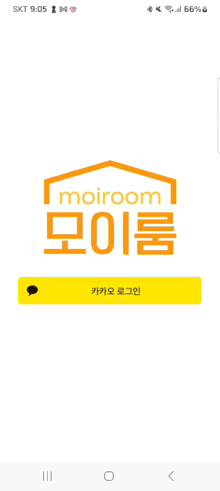
  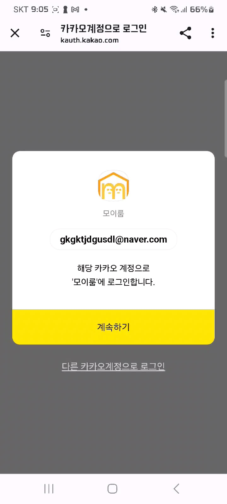
</div>

### 🧑🏻‍💼 기본 정보 및 자기 소개 등록
  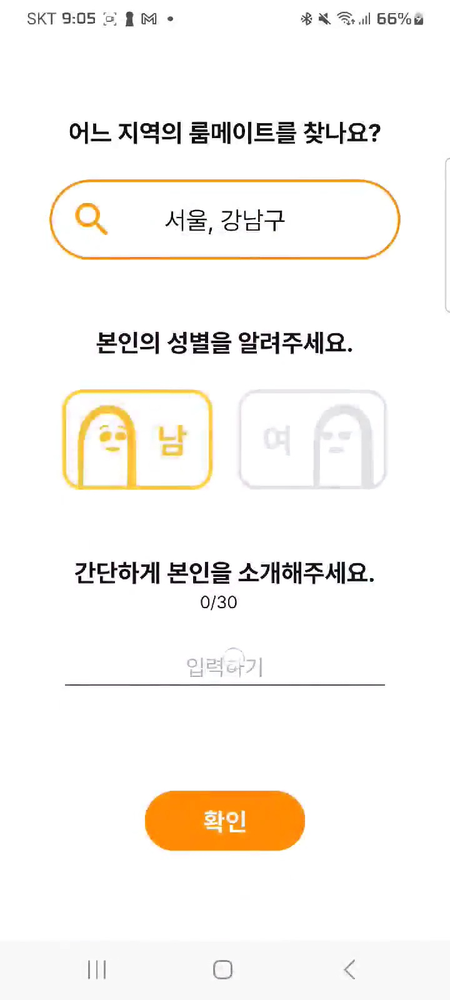

### 🧑🏻‍ 사용자 권한 허용
<div style="display: flex; flex-direction: row;">
  
  
  
  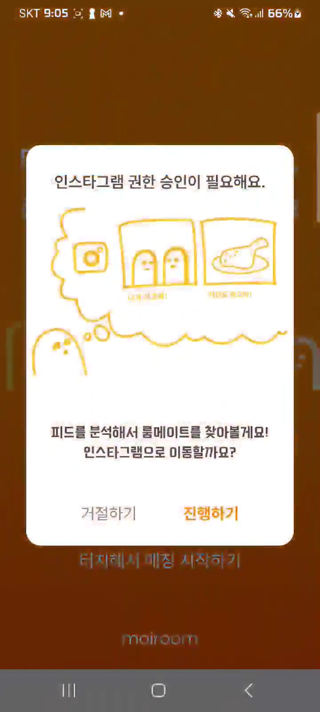
  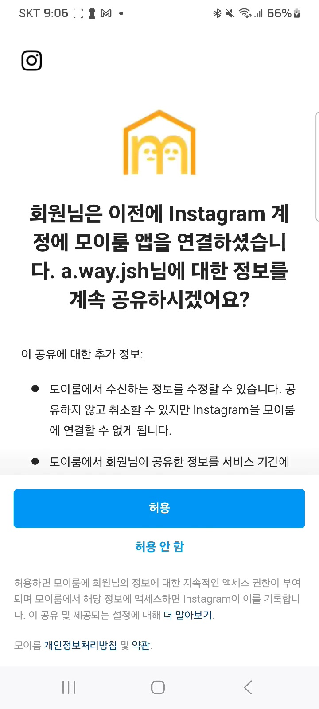
  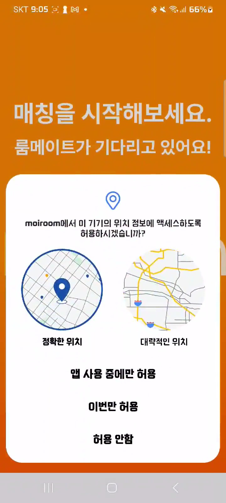
</div>

### 🧑🏻 성향 분석 및 룸메이트 추천
<div style="display: flex; flex-direction: row;">
  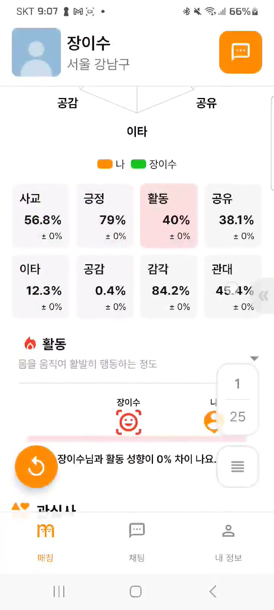
  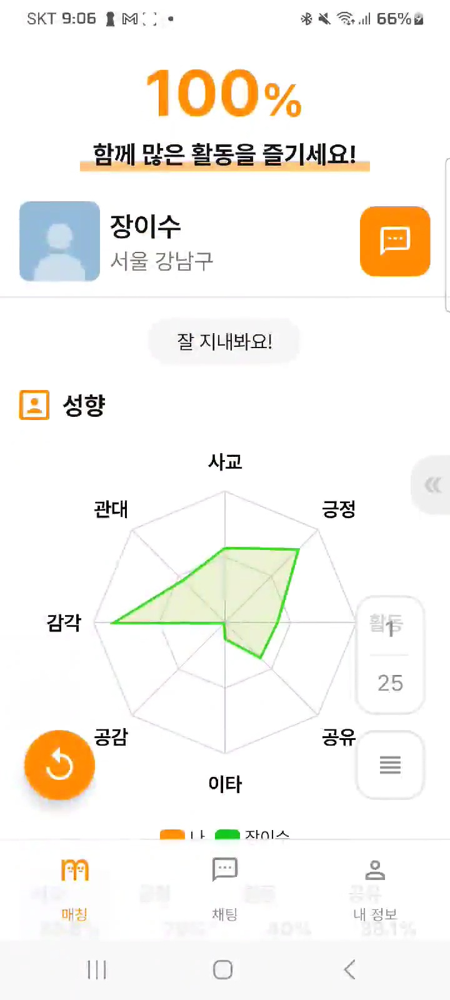
  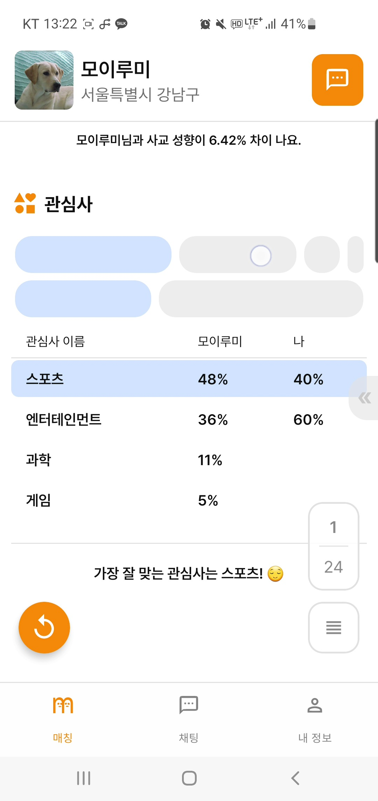
</div>

### 💬 채팅
<div style="display: flex; flex-direction: row;">
  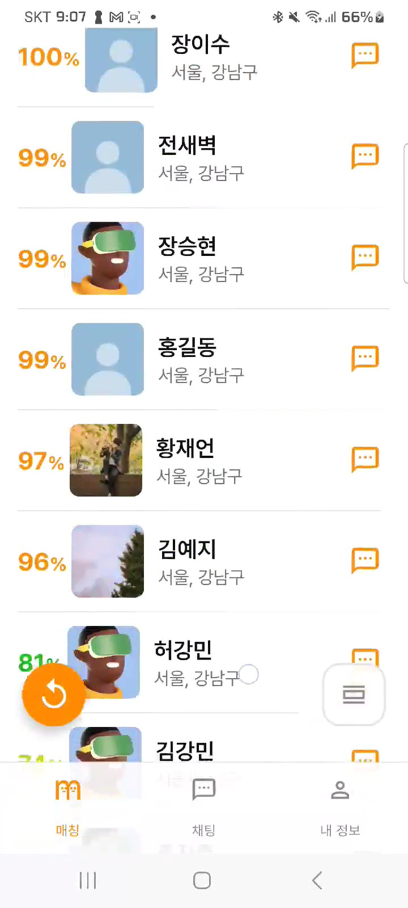
  
</div>

### 💁 정보 수정 및 기타 기능
<div style="display: flex; flex-direction: row;">
  
  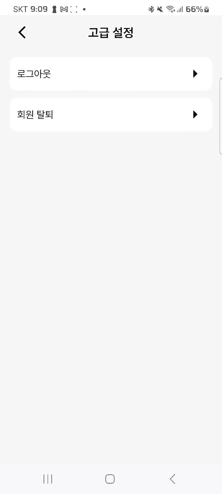
</div>

<br/>
<br/>

# 🔍3. 산출물
## 4-1. ERD
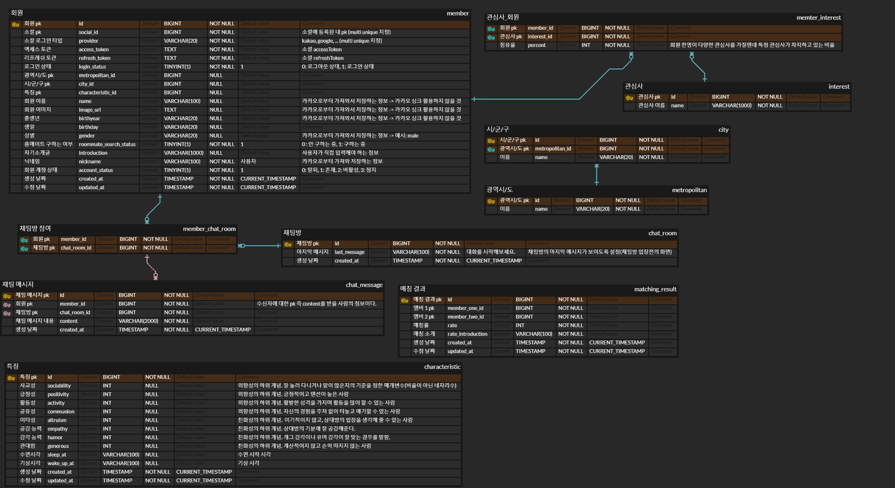
## 4-2. 시스템 아키텍처
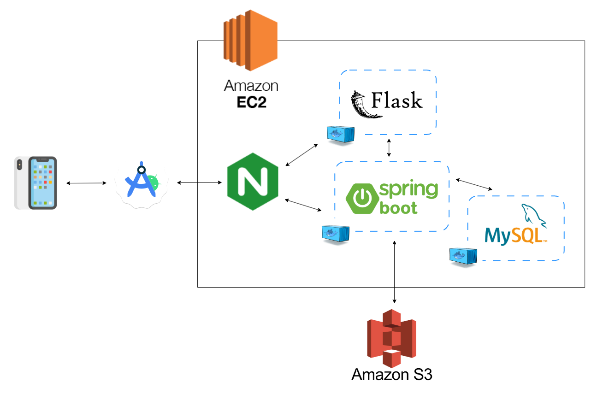
## 4-3. 결과 영상
[](https://youtu.be/1s90BR-ahNY)
<br/>

# 🔍4. 구현한 기능
- 소셜 로그인 및 회원 정보 관련 API 구현
- 지역 정보 등록 관련 API 개발
- Web Socket을 활용한 룸메이트 채팅 서비스 API 개발


# 🔍5. 깨달은 점
- jpql 활용법
- spring을 활용한 WebSocket의 설정 방법
- WebSocket의 ws 프로토콜에 대한 이해
- OAuth에 대한 이해
- spring security 필터의 개념
- spring security에 JWT 필터 적용 방법

# 👩‍👦‍👦6. 팀원 소개

### 📱안드로이드
| [황재언](https://github.com/JaeEonHwang)                                                   | [정성현](https://github.com/JungSungHyeon)                                                 | [김준수](https://github.com/julsukim)                                                                                |
|-----------------------------------------------------------------------------------------|-----------------------------------------------------------------------------------------|-------------------------------------------------------------------------------------------------------------------|
|  |  |  |

### 💻 백엔드
| [진주성](https://github.com/vmfaldwntjd)                                                                                                  | [전새벽](https://github.com/toqurJeon)                                                                | [김예지](https://github.com/ykim-yeji) |
|----------------------------------------------------------------------------------------------------------------------------------------|---------------------------------------------------------------------------------------------------|------------------------------------|
|  |  |   |
